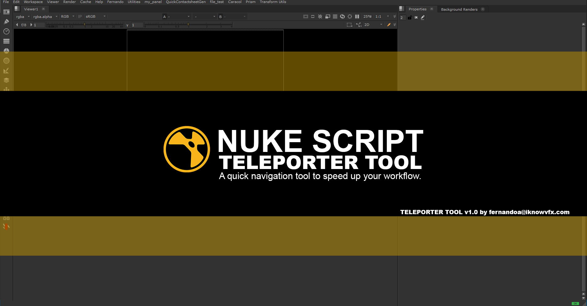
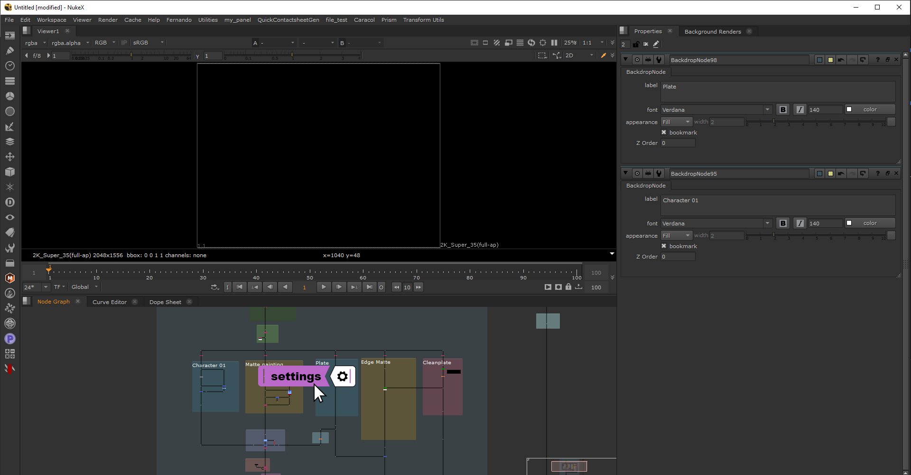
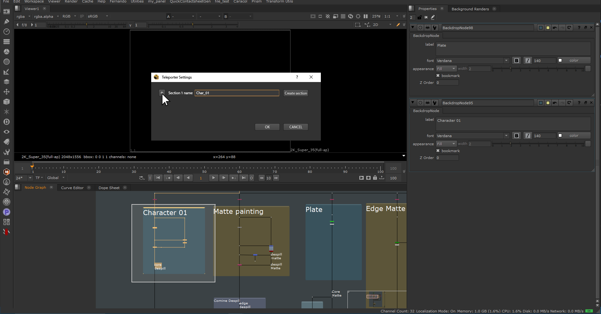
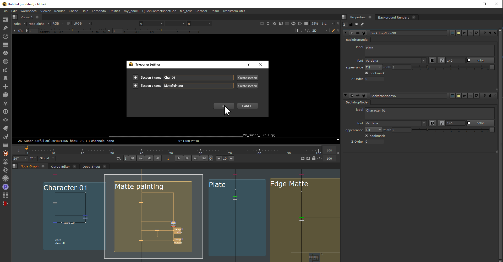
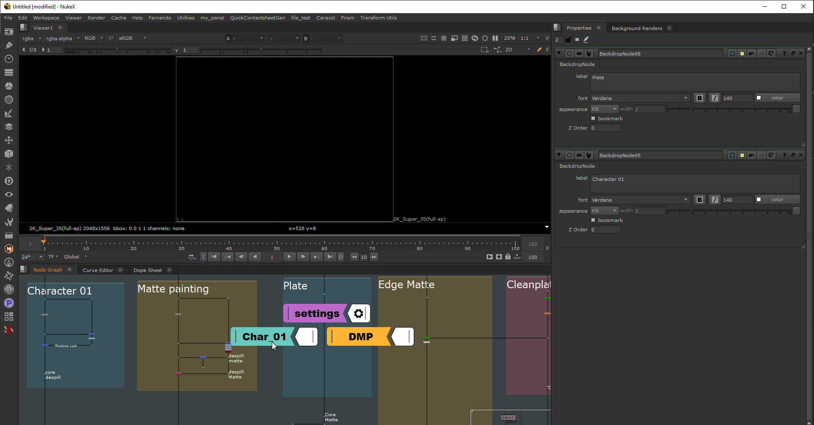

VERSION 1.0 

INTRODUCTION

Teleporter is a Nuke tool designed to increase productivity by making navigation through Nuke scripts faster. 
A Bookmark like system, will allow the user to set up chosen parts of the script that will need to be revisited constantly and can jump between them quickly with a couple of clicks.

ENVIRONMENT [in development]
OS: Windows (Linux, Mac)

PROJECT FEATURES

- Quick and easy Nuke script navigation via bookmarks.
- Project customization. [future feature] Add icons and images to customize the tool according to the current project to give it some flavor.

USING THE TELEPORTER

Follow the installation instructions and then go to the desired Nuke script and call it by pressing ALT + T and you will be prompted with a settings button.

After clicking the button you will have to select the area of you script that you want to connect it with along with entering it's name, then press OK.

You can repeat the previous step as many times as you want depending on how many areas of your script you want to bookmark.

Once the set up is done use the shortcut again to see the buttons you previously created appear over Nuke UI, then with a simple click, the node graph will teleport you to the designated area.

Enjoy it!

Development road map:

- January - March 2023: Development of the core functions and UI Design.
- March 2023: Add Option to save custom settings
- June 2023: Deployment of Alpha v1.0
- June - July 2023: Bug fixes and optimization. 
- July - August 2023: Deployment of Beta v1.0

